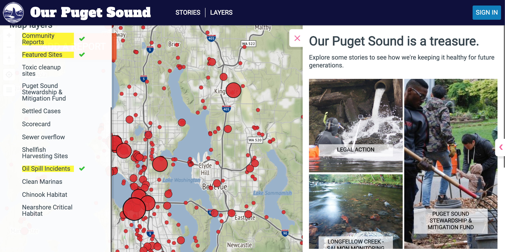

# Puget Sound Water pollution interaction Map Analysis
link to the project: [Puget Sound Keeper]

## Introduction and Analysis
> This project is an interactive web map that displays some information about the water in the Puget Sound Area in Washington State. It allows the user to select different base maps, information layers, and stories. The main function of this project is for displaying some major pollution or incident in the Puget Sound Area. Such as water pollution, oil spill, fish habitat, and other useful information. This allows the public to understand what the situation around the area is, what kind of improvement could they do to help. This Project is aiming for public users and. For those Who are looking for understanding the current environmental pollution and habitat crisis. By using this interactive web platform, it could also help potential environmental maintenance company. This allows them to make a better environmental caring plan, understand the situation in a different area to do any maintenance or construction. This interactive web tool is created by Puget Soundkeeper, an organization that is aiming to stop pollution. They took care of the Puget sound water region since 1984, committed to taking care of the environment by taking action against violators, removing trash in the water, and host multiple cleanup events with thousands of volunteers. They tried their best to keep our water clean and away from pollution, to allow us to have an amazing environment.  

> Analyzing this project, contains four systematic architectures, client, server, and data. For the client-side, it is an interactive web map too that allows the user to click about the sidebar to select the base map, layers of different information, and a button for submitting any pollution report. This allows the user to interact with the map to help them understand different kinds of information. As for the server-side, it handles the requests, such as change base maps, display layers, and file a report. It sends any user request to the webserver and access to the database for data storing or retrieving for display purposes. It also contains a geospatial server that handles any geospatial data. Such as displaying oil spill in a different location on the map, handling oil spill reports on a specific location. Storing all the geospatial data into the database and retrieving data from the database. As for the data side, they store the dataset in the AWS as their location to store the GeoJson data for geospatial data display. And Mapbox base map to display different base maps on the interactive web tool. This allows them to call the information with the API connection from the AWS s3 bucket.

> While inspecting this interactive web tool for the Puget Soundkeeper. When it loads the web page in the first place, it fetches a couple of things to display the basic information on the website. Such as displaying multiple png files to display the base map, a couple of different JavaScript libraries to get ready to handle some front-end information displays. By clicking on any layer, it will send the get request to the request URL. In their case, it will send the request to the AWS web s3 bucket to retrieve the geojson data to display the layer information; and request to Mapbox URL to get the base map. Mostly the data flow between the client and server-side is using the get method to retrieve the data from the server to display the formation on the web application. There are a couple of major JavaScript libraries that in this web application. Such as Backbone.js, it is a front-end framework that could handle the data with the REST API integration and CRUD functions ( Create, Read, Update and Delete) to store and retrieve the data from the database; JQuery.js, a common JavaScript library that handles some functionality that mouse click, hover, load information when the web page is ready, and other mouse or keyboard function that could improve the interaction performance; Underscore.js, a special Javascript Library that is tied to JQuery and backbone.js. it handles Arrays and Objects data structure to work smoothly in the web application with multiply built-in functions. This interactive web tool works pretty well on laptop and mobile devices, it does support responsive design and different layout to fit the need from different users. Due to this is a reporting and information display platform, it is best  to be responsive to support people to report and retrieve any information from anywhere and anytime. With a mobile application is could improve the mobilty of this web tool that could allow everyone to access and report easier.
## Data Sources
* vector data:
    * multiple geojson data stored in AWS S3 bucket
    * Points layer that displays the following data
        * Oil Spill incidents
        * Toxic cleanup sites
        * Sewer overflow
        * Shellfish Harvesting Sites
        * Clean Marinas
        * And more
    * Polyline layer that displays the Salmon (Chinook) Habitat
    * Polygon layer that displays the Nearshore Critical Habitat
* The raster data in this project is mainly the Mapbox basemaps that allow the user to switch to different kinds of basemaps 
Overall the UI/UX design is relatively clean and simple, there's some pros and cons for UI/UX design.
* Pros:
    * Clean side bar that allows the user the select different basemap, layer to view
    * Allow the user to file any pollution incident by click the big red button on the website
    * Allow the user to understand some stories about the Puget Sound Area, and why we need to take care of our environment. Talking about their current project and why pollution will change our environment.
* Cons:
## Website Features
* Basemap
    * simply allow the user to select different kind of basemap
* Layers:
    * different layer show varies information for the user
* interaction features
    * Select layers to display information
    * Button to submit pollution incident
    * Read user's geolocation
    * Zoom in and out
    * Read different incident stories
## Website elements
* North Arrow
* Zooming button (+ and -)
* Button for getting your geolocation
* Navigation Bar on the top for buttons (stories and layers)
* Hamburger sidebar toggle button (allow users to select different basemap and layers of information)
* Submit button that allows the user to file a report by dragging and droping the marker on the map or by reading the user's geolocation
* Responsive design that allows the user to load the webpage with laptop and mobile devices
* Side arrow on the right that allow the user to read different incident report that is posted by different user.
## Strength and Weakness
| Strength | Weakness |
| -------- | -------- |
|Simple and Clean | not frequently updated |
|Displayed sufficient information| seems like it only has website version, do not have mobile app version|
|Easy to navigate | no scale bar, legend and data source at the bottom of the page |
|Clear layer selection, allow user to understand the difference | not a secure connection, which the user's geolocation might be accessible to hackers if the user shares the location|

## Reflection on digital divide, surveillance and environmental problem
* Digital Divide
    * This interactive web tool requires some basic internet connection to load the page, which means that some people with poor internet connection might not be able to connect with this application 
    * poor internet connection might mean that the web tool will have difficulties while acquiring the geolocation of the user
    * For most people, this web tool is relatively light weight, which means that it does not require high spec laptop or mobile phone to run the tool
    * This means that the only digital divide that stops people from using this web tool is the internet speed, since this web tool does not require high spec device to be able to run it.
    * It is suitable for everyone who has the internet connection when they need to understand the pollution incident around their area or report any incident.
* Surveillance
    * This project is the good example that it could keep track of any incident around the Puget Sound area. To allow the government and the local companies could response to the situation fast by looking at this interaction tool
    * Public users could also understand if there's any incident around them that they will need to pay attention to. This application could also allow the publics to monitor their surrounding that they could report incident.
    * The public could also understand if the government or the companies is doing their work to keep our environment clean, and monitor the potential risk of what can those incident bring to our life.
* environmental Problem
    * With this web tool, it does reflect some environmental problems. Such as over harvesting,oil spill or other environmental incident that leads to the critical area in the nearshore in Puget Sound Region
    * This web tool also reflects that no matter where we lived, we need to care about our environment. To allow the environment to support our live, such as clean water, non-toxic soil and fish habitat.

[Puget Sound Keeper]: https://soundkeeper.mapseed.org/page/stories